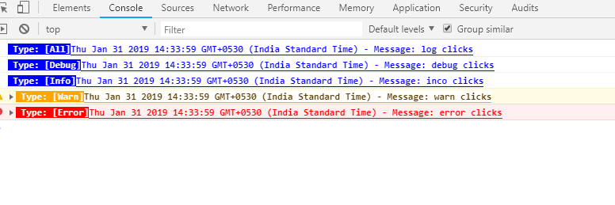
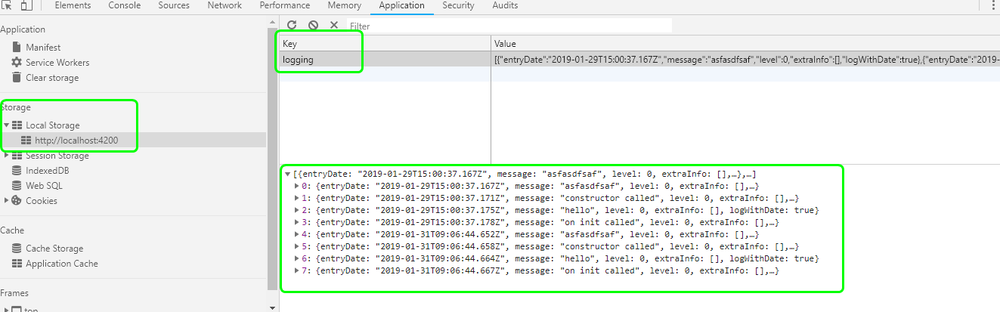
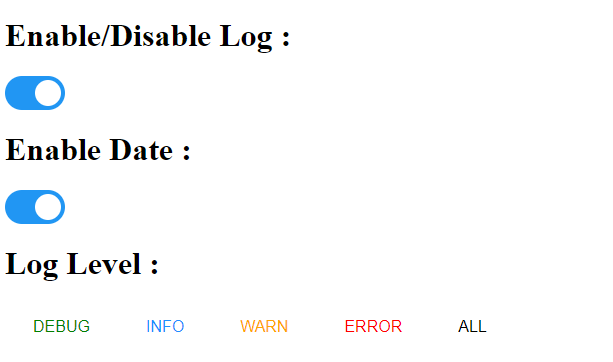

[](https://badge.fury.io/js/%40ng-log%2Flog4a)
[](https://travis-ci.org/moneybharathe/Log4a)
# Log4A : Logger library for Angular6+

> A powerful and customizable logging library for Angular application.

### New Features!

-	Pretty print log messages with timestamp, file name, method name, line number, path or call stack.
-	Support user-defined logging levels.
-	Support console, local-storage and server-side appenders.
-	Support file based configuration(logging-config.json).
-	Support runtime configuration through query param.
-	GUI supports for enable/disable logs, timestamp, setting user-defind log level at runtime.
	

## Installation
Install the dependencies and devDependencies and start the server.

#### Prerequisite
	-HttpClientModule
	-rxjs latest

```sh
$ npm install @ng-log/log4a
```

## Configuration
- ***FileBased Configuration***
- ***Runtime Configuration***


## Setup for both File based and Runtime configuration.

#### Step1:

>   Create a json file in "assets/logging-config.json" location with below format.
```typescript 
[
{
"appenderName": "console",
"location": "",
"enable":  true
},
{
"appenderName": "localstorage",
"location": "logging",
"enable": false
},
{
"appenderName": "serverapi",
"location": "/api/log",
"enable": false
}
] 
```
		
#### Step2:

> Add HttpClientModule, Log4aModule, Log4a and AppenderService


```typescript

/*Should add APP_INITIALIZER, HttpClientModule, Log4a libraries provided below */
import { NgModule, APP_INITIALIZER } from '@angular/core';
import { HttpClientModule } from '@angular/common/http';
import { Log4aModule, AppenderService, Log4a } from '@ng-log/log4a';

@NgModule({
  declarations: [AppComponent, ChildComponent],
  imports: [HttpClientModule, Log4aModule, BrowserModule],
  providers: [
    AppenderService,
    Log4a,
    {
      provide: APP_INITIALIZER,
      useFactory: (config: Log4a) => () => config.loadConfigs(),
      deps: [Log4a],
      multi: true
    }
  ],
  bootstrap: [AppComponent]
})
export class AppModule { }
```


#### Final step :
>   You can inject Log4a service to avail logger service.

```typescript
    constructor(public logger: Log4A) {
	/*you can pass any data type like String, Object type and Arrays */
        this.logger.log('Hello Angular');
    }
```
**And you will see the message in the console of browser:**



**you will see the message in the Local storage area of browser:**

  


## Support user-defined logging levels.

 ```typescript
        this.logger.debug("debug logs");
        this.logger.warn("warn logs");
        this.logger.error("error logs");
        this.logger.info("info logs");
        this.logger.log("logs");
 ```


## Support Multi Logging system in ***FileBased Configuration***.
 Inspired from java ***log4j***; API provides three appenders.

>   Console Appender - Console appender is a very simple service that displays logs data to the console window. 
>   Local Storage Appender - It can store data locally with in the user’s browsers.
>   Server logs - A server logs can store the log information from all clients in one location.

you can configure one or more appenders by setting the below flag as true.

```
{
"appenderName": "console",
"location": "",/*Leave it as empty; should not chage this value*/
"enable":  true /*You can enable/disable this flag to use the log system*/
},
{
"appenderName": "localstorage",
"location": "logging",/*By default location name is logging; location property is customizable*/
"enable": false
},
{
"appenderName": "serverapi",
"location": "/api/log", /*By default location name is '/api/log'; location property is customizable*/
"enable": false
}
```


## Runtime Configuration
-   You can configure the logger via query parameter.
-   Support changing the logger system on the fly, while the program is running, 

``` javascript
    Console Appender : 
    http://<apphost>:<port>/?logger-option=console
    Local Storage Appender :
    http://<apphost>:<port>/?logger-option=localstorage
    Server log Appender :
    http://<apphost>:<port>/?logger-option=webapi
```
***Note: If you are not passing any query param it will take configuration from logging-config.json file***

## UI component for Managing Logs
-   Enable/Disable Logs through UI.
-   Enable/Disable Timestamp.
-   Setting User-defined log levels.

### Setup of UI Components
```javascript
import { Log4aModule} from '@ng-log/log4a';
/**use below selector to use log ui components:**/
<log-config></log-config>
```

**you can use user interface to enable/disable logs, setting Log levels**
   


### Errors and Solutions

>   main.ts:12 NullInjectorError: R3InjectorError[ApplicationModule -> ApplicationRef -> ApplicationInitStatus -> InjectionToken Application Initializer -> [object Object] -> Log4a -> AppenderService -> HttpClient -> HttpClient -> HttpClient]: NullInjectorError: No provider for HttpClient!

>   Solutions : Please import HttpClient Module in your Appmodule / Bootstrap Module.